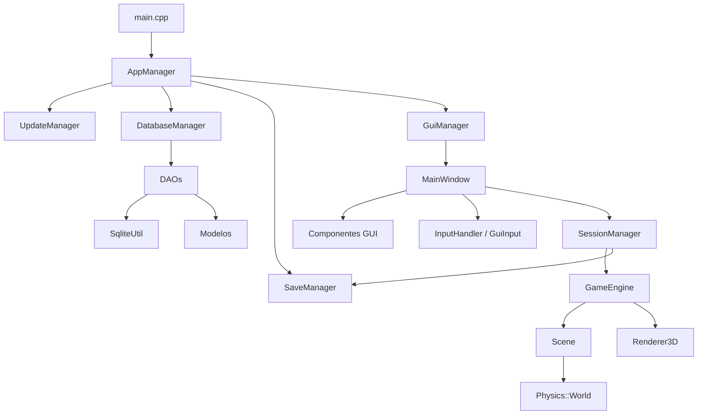
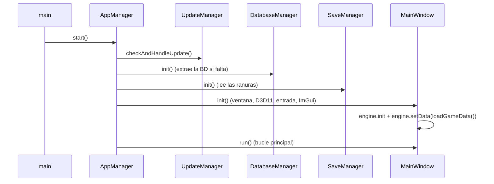

[← Volver al índice](../README.md)

# Arquitectura

## Tecnología

| Elemento | Uso |
|---|---|
| C++17 | Lenguaje (compilador MSVC) |
| Win32 | Ventana, mensajes, Raw Input, XInput |
| DirectX 11 | Render 3D propio (HLSL embebido en `renderer3D.cpp`) |
| Dear ImGui | Interfaz (menús, HUD) con backends Win32 y DX11 |
| SQLite (amalgamation) | Base de datos |
| nlohmann/json | Guardado y versiones |
| stb_image | Carga de PNG (logo) |
| WinHTTP / PowerShell | Actualizaciones |

Las dependencias externas se descargan en la compilación. Ver [Compilación y releases](compilacion.md).

## Capas

| Capa | Carpeta | Responsabilidad |
|---|---|---|
| Managers | `app/managers` | Coordinan la aplicación: arranque, base de datos, guardado, sesión, GUI, actualizaciones |
| GUI | `app/gui` | Ventana, estados, entrada, componentes de interfaz y estilo |
| Motor | `app/engine` | Lógica de juego (`core`, `world`, `physics`) y render 3D (`render`). No depende de la GUI |
| Daos | `app/daos` | Consultas SQL y conversión a modelos |
| Modelos | `app/models` | Estructuras de datos puras |
| Utils | `app/utils` | Utilidades sin lógica de juego: archivos, rutas, log, JSON, SQLite, D3D, entrada, red |

## Principios de diseño

- **Una sola fuente de verdad:** rutas y URLs solo en `PathsUtil`; aspecto de Pokéballs, cofres y nodos solo en `PokeballStyle`, `ChestStyle` y `ResourceStyle`; reglas de azar en `CaptureRules` y `ChestRules`.
- **Datos en la base de datos, motor ajeno a ella:** el motor recibe un `GameData` ya cargado.
- **El HUD no conoce la escena:** la interfaz lee un `GameStatus` que construye el motor cada frame.
- **Entrada independiente del dispositivo:** teclado, ratón y mandos se convierten en un `InputState`.
- **Física compartida:** todo cuerpo (jugador, Pokéballs, cofres, nodos) pasa por `Physics::World::step`.
- **Sin excepciones en la lógica de uso:** JSON y archivos devuelven `optional`/valores vacíos; solo D3D lanza excepción en fallos críticos.

## Flujo de arranque

`main.cpp` envuelve todo en un `try/catch` que registra cualquier excepción en el log.

## Bucle principal (`MainWindow::run`)

1. Procesa mensajes de Windows.
2. Refresca los dispositivos de entrada si cambiaron y decide quién lee el mando (el juego o la interfaz).
3. **Espera pasiva** si no hay nada que dibujar (estados no animados): duerme hasta recibir un mensaje o, con un mando conectado, 50 ms para leerlo.
4. Calcula `dt` (limitado a 0,1 s).
5. En juego: lee la entrada, actualiza el motor, gestiona la pausa y el autoguardado.
6. Dibuja la escena 3D (si está en juego) y después la interfaz con ImGui.
7. Si cambia el estado, ajusta pantalla completa y guarda al salir de la partida.

Al salir del programa en plena partida se guarda y se liberan los recursos (ImGui antes que el dispositivo D3D).

## Registro (log)

`Logger` escribe en consola y en `app/logs/app.log` con el formato `[NIVEL][MÓDULO] mensaje`.

---

[← Volver al índice](../README.md) · Anterior: [Base de datos](base-de-datos.md) · Siguiente: [Motor de juego](motor.md)
