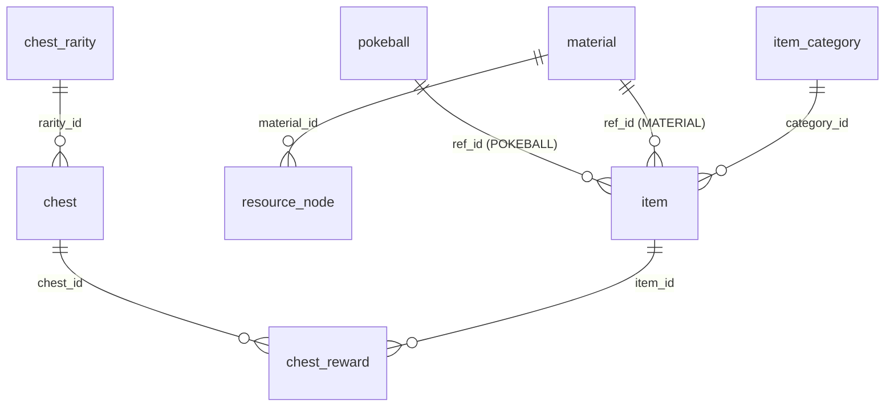

[← Volver al índice](../README.md)

# Base de datos

Los datos de juego (Pokéballs, objetos, materiales, cofres y nodos de recolección) viven en una base de datos **SQLite**: `app/data/db/pokemonEdge.db`. Se cargan una sola vez al arrancar (`DatabaseManager::loadGameData`) y el motor solo recibe una estructura `GameData`.

## Incrustación y cifrado

1. `resources.rc` incrusta `app/data/db/pokemonEdge.db` en el ejecutable como recurso (`IDR_DATABASE`), junto con el icono (`IDI_ICON1`).
2. Durante la compilación (GitHub Actions), la base de datos se **cifra con XOR** de un byte antes de incrustarla. La clave sale del secret `DB_ENCRYPTION_KEY`; si no existe, se usa `90`. El mismo valor se pasa al compilador como `XOR_KEY_VAL`.
3. Al arrancar, si `app/data/db/pokemonEdge.db` no existe, `DatabaseUtil::extractDatabaseIfNeeded` descifra el recurso y lo escribe en disco.
4. `SqliteUtil` abre una única conexión de lectura/escritura que se reutiliza.

> El XOR es una ofuscación, no un cifrado seguro. Ver [Compilación y releases](compilacion.md).

## Scripts SQL

Están en `testing/sql/` (carpeta ignorada por Git: `/testing` en `.gitignore`). Se aplican sobre la base de datos de desarrollo `app/data/db/pokemonEdge.db`, **en este orden**:

| Orden | Script | Crea |
|---|---|---|
| 1 | `pokeball.sql` | `pokeball` |
| 2 | `material.sql` | `material`, `resource_node` |
| 3 | `item.sql` | `item_category`, `item` |
| 4 | `chest.sql` | `chest_rarity`, `chest`, `chest_reward` |
| — | `type.sql` | `type` (independiente) |

`item.sql` elimina `chest_reward` al ejecutarse, así que si lo reaplicas debes volver a aplicar `chest.sql` después.

## Modelo de datos

### Tablas

| Tabla | Columnas | Descripción |
|---|---|---|
| `pokeball` | `id`, `name`, `description`, `capture_multiplier` | Tipos de Pokéball |
| `material` | `id`, `name`, `description` | Materiales de recolección |
| `resource_node` | `id`, `name`, `action`, `material_id`, `hits`, `min_yield`, `max_yield`, `spawn_weight` | Nodos del mundo (árbol, roca…) |
| `item_category` | `id`, `name` | Categorías de objeto: `POKEBALL`, `MATERIAL` |
| `item` | `id`, `category_id`, `ref_id` | Objeto del juego; `ref_id` apunta a la fila de la tabla de su categoría |
| `chest_rarity` | `id`, `name` | Común, Raro, Épico |
| `chest` | `id`, `name`, `rarity_id`, `spawn_weight` | Tipos de cofre |
| `chest_reward` | `id`, `chest_id`, `item_id`, `quantity`, `probability` | Recompensas posibles de cada cofre |
| `type` | `id`, `name` | Tipos de Pokémon (19 tipos; de momento no se usa en el juego) |

Los nombres y descripciones de un objeto no están en `item`, sino en la tabla de su categoría.

## Datos iniciales

**Pokéballs:** Poké Ball (×1,0), Super Ball (×1,5), Ultra Ball (×2,0).

**Materiales:** Madera, Piedra, Hierro, Carbón.

**Nodos y cofres:** ver las tablas completas en [Jugabilidad](jugabilidad.md).

## Acceso desde C++ (DAOs)

| DAO | Tabla(s) | Modelo |
|---|---|---|
| `PokeballDao` | `pokeball` | `PokeballType` |
| `ItemDao` | `item` + `item_category` | `Item` |
| `MaterialDao` | `material` | `Material` |
| `ResourceNodeDao` | `resource_node` | `ResourceNodeType` |
| `ChestDao` | `chest` + `chest_reward` | `ChestType` (con sus `ChestReward`) |
| `TypeDao` | `type` | `PokemonType` |

`DaoRow` agrupa la lectura de columnas (`text`, `integer`, `real`). `SqliteUtil::executeSelect` devuelve filas como mapas `columna → texto`. `DatabaseManager` instancia los DAO y expone `loadGameData()`.

Si una tabla no existe o está vacía, el DAO lo registra en el log indicando qué script falta aplicar.

## Añadir una categoría de objeto nueva

1. Crear su tabla (con nombre, descripción y demás datos).
2. Añadir una fila en `item_category`.
3. Insertar sus objetos en `item` (`category_id` + `ref_id`).
4. Añadir el valor en `ItemCategory` (`app/models/item.hpp`) y en `ItemCategoryText::parse`.
5. Crear su modelo y DAO, cargarlo en `GameData` / `DatabaseManager::loadGameData`.
6. Hacer que `GameData::itemName` devuelva el nombre desde la nueva tabla.

---

[← Volver al índice](../README.md) · Anterior: [Actualizaciones](actualizaciones.md) · Siguiente: [Arquitectura](arquitectura.md)
