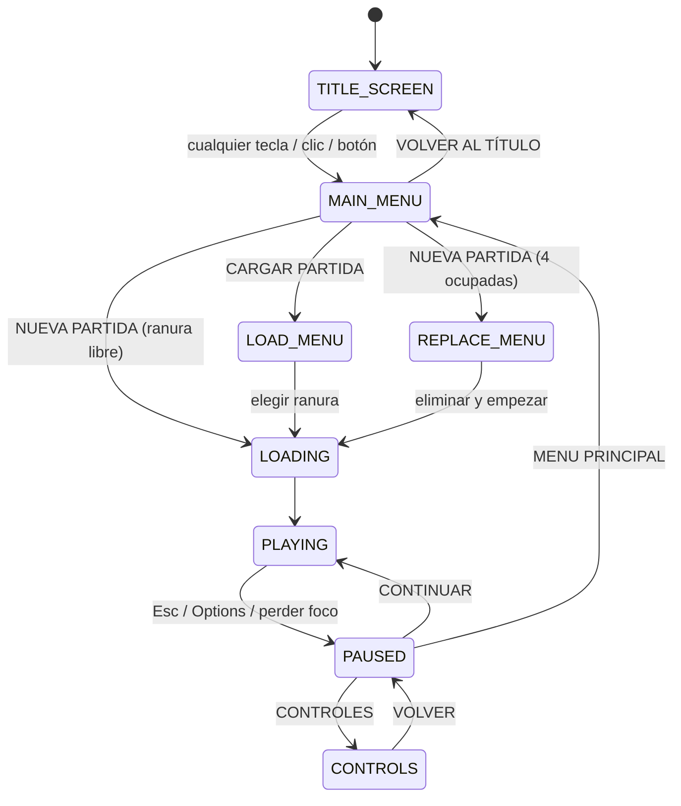

[← Volver al índice](../README.md)

# Interfaz (GUI)

Código en `app/gui/`: `window`, `components`, `style` y `gameState.hpp`.

## Estados (`gameState.hpp`)

Funciones auxiliares:

| Función | Estados |
|---|---|
| `isInGame` (la escena 3D se dibuja de fondo) | PLAYING, PAUSED, CONTROLS |
| `isFullscreen` (pantalla completa) | LOADING y todos los `isInGame` |
| `isAnimated` (se redibuja continuamente) | TITLE_SCREEN, LOADING, PLAYING |

Los demás estados solo se redibujan cuando llega un evento.

## Ventana (`window/`)

| Archivo | Responsabilidad |
|---|---|
| `mainWindow.*` | Crea la ventana (960×540), inicia D3D/ImGui/motor, bucle principal, cambio de estados, autoguardado |
| `graphicsDevice.*` | Dispositivo D3D11, swap chain, render targets, redimensionado, carga de texturas (GPU y, si falla, WARP) |
| `inputHandler.hpp` | Entrada de la plataforma durante el juego: teclado, ratón (Raw Input), mandos Xbox y PlayStation; convierte todo en `InputState` y decide el dispositivo activo |
| `guiInput.hpp` | Mando en los menús: alimenta la navegación de ImGui y detecta "volver" y "pausa" |

Detalles:

- El cursor se oculta y se bloquea solo mientras se juega, con Raw Input para el ratón.
- Al entrar o salir de la partida cambia quién lee el mando (`InputHandler` en juego, `GuiInput` en menús).
- Windows avisa de cambios de dispositivos (`WM_DEVICECHANGE`); se vuelve a buscar mandos una vez por iteración y otra tras 1 s (el driver puede tardar).
- Al perder el foco se pausa el juego y se sueltan las teclas.
- El swap chain solo se redimensiona al terminar de arrastrar el borde de la ventana.

## Componentes (`components/`)

| Componente | Pantalla |
|---|---|
| `titleComponent` | Título con logo y texto parpadeante |
| `menuComponent` | Menú principal |
| `slotsComponent` | Cargar partida y reemplazar partida (con confirmación) |
| `loadingComponent` | Barra de carga (1,5 s simulados) |
| `hudComponent` | HUD en partida: FPS, capturas, materiales, mira, selector de Pokéball, ayudas, avisos, indicador de guardado |
| `pauseComponent` | Menú de pausa |
| `controlsComponent` | Pantalla de controles dibujada según el dispositivo en uso |

Cada componente tiene una función `render(...)` que recibe el estado y devuelve, si procede, la acción elegida; la decisión de qué hacer la toma `MainWindow`.

## Estilo (`style/`)

| Archivo | Contenido |
|---|---|
| `guiStyle.hpp` | Paleta (`ACCENT`, `PANEL`, `SURFACE`, `FOREGROUND`, `MUTED`, `SUCCESS`, `DANGER`) y tema de ImGui |
| `guiLayout.hpp` | Piezas de maquetación: centrado, botones, separaciones, velo oscuro |
| `guiDraw.hpp` | Primitivas con `ImDrawList`: teclas, ratón, botones frontales de mando |
| `guiPrompts.hpp` | Ayudas "qué botón pulsar" con icono según el dispositivo |

> No uses `min` / `max` como nombres de variable en archivos que incluyan `windows.h`: son macros. El código usa `(std::min)` y `(std::max)`.

## Autoguardado y aviso

`MainWindow` lleva el temporizador de autoguardado (cada 30 s; primero a los 10 s) y la opacidad del aviso `Guardando...`, que se pasa al HUD. Ver [Guardado de partidas](guardado.md).

---

[← Volver al índice](../README.md) · Anterior: [Motor de juego](motor.md) · Siguiente: [Compilación y releases](compilacion.md)
